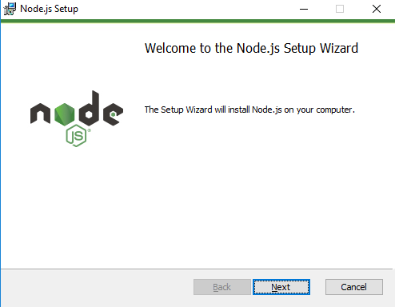
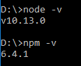
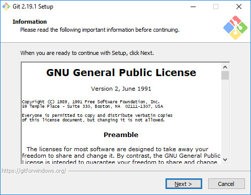
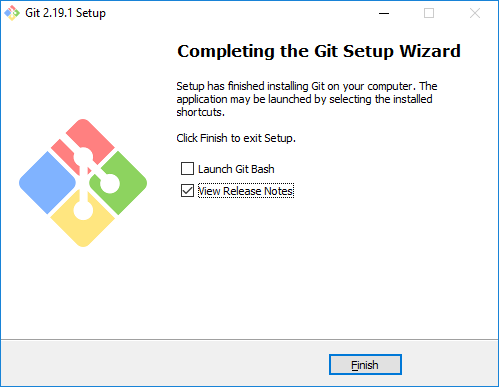

## Step 2:  Setup Android Studio, Node JS and Git

### (Optional) Setup Node.js

Node JS is a SDK / Programming Language used in this tutorial.   The version of Node.js used in this tutorial is v10.13.0.  Follow the step below to install Node.js.  

1.	Download the Node.js installer from this URL.  [https://nodejs.org/en/download/](https://nodejs.org/en/download/).  This tutorial is written with Windows 10 and uses the 64-bits Windows Installer (.msi)  

2.	After download is completed, double click the downloaded .msi file to start the installer.  
  

3.	Follow the instructions to install Node.js.    

4.	After installation is completed, verify the installation by opening the Command Prompt.  Run 'node' and 'npm -v' to verify installation and version.  
  

5.	(Optional)  Proxy setup.  Depending on the location of the laptop / desktop, proxy settings may be needed.  Run the following command to configure proxy.  Change the proxy host and port to your company proxy accordingly.  

```
   npm config set proxy http://proxy.mycompany.com:8080
   npm config set https-proxy http://proxy.mycompany.com:8080
```

Or use the below commands if id and password are required from proxy. If your password contains special characters, you will need to encode them, e.g. `#` will become `%23`

```
   npm config set proxy http://<user>:<password>@proxy.mycompany.com:8080
   npm config set https-proxy http:// <user>:<password>@proxy.mycompany.com:8080
```

***

### (Optional) Setup Git

Git is a source code management tool used in this tutorial.  Follow the step below to install Git client.  

1.	Download the Git client installer from this URL.  [https://git-scm.com/downloads](https://git-scm.com/downloads).  This tutorial is written with Windows 10 and uses the 64-bits Windows Installer.  

2.	After download is completed, double click the downloaded .exe file to start the installer.  
 

3.	Follow the instructions to install the Git client. This screen shows up when installation is completed.  
  

4.	(Optional)  Proxy setup.  Depending on the location of the laptop / desktop, proxy settings may be needed.  Run the following command to configure proxy.  Change the proxy host and port to your company proxy accordingly.

```
   git config --global http.http://github.com.proxy http://<user>:<password>@proxy.mycompany.com:8080
   git config --global http.http://github.com.sslverify false
   git config --global http.https://github.com.proxy http://<user>:<password>@proxy.mycompany.com:8080
   git config --global http.https://github.com.sslverify false
```


