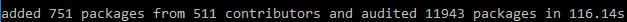
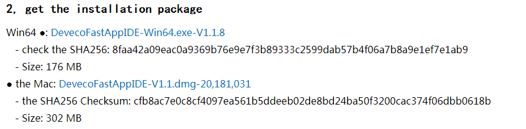
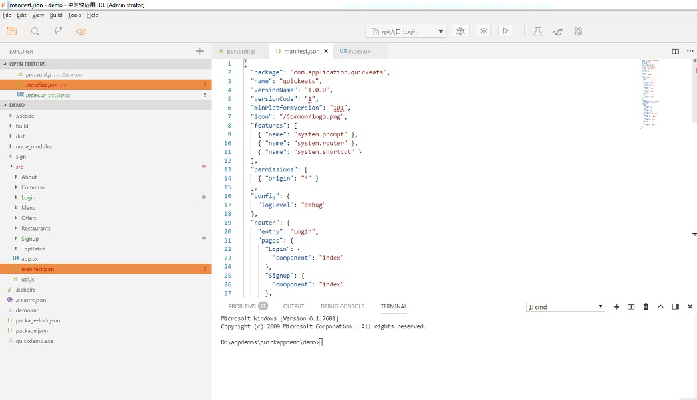
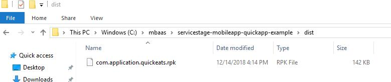

### Step 3:  Load Quick App Sample from Github

Follow the steps below to load a Quick App Mobile Application Sample from Github.

1.	Open the Command prompt and navigate to your development workspace. Then run `git clone https://github.com/CPE-OAuth/servicestage-mobileapp-quickapp-example.git`  

   If you are having issues cloning the project, you can instead visit the url and download the project as a zip.

2.	Change to `servicestage-mobileapp-quickapp-example` directory using `cd {{path to}}/servicestage-mobileapp-react-example`

3.	Run `npm install` to install project dependency.  It may take some time to install all dependency.  Once completed, it shows a line similar to the below.  
  

4.	We will use the Huawei fast Application IDE to quickly build a fast application development environment. The IDE can be install from: [https://developer.huawei.com/consumer/cn/service/hms/catalog/fastapp.html?page=fastapp_fastapp_devprepare_install_tool](https://developer.huawei.com/consumer/cn/service/hms/catalog/fastapp.html?page=fastapp_fastapp_devprepare_install_tool) 

5.	For Win64: Click DevecoFastAppIDE-V1.1.8-Win64.exe to install.

6.	After the installation, launch the IDE and click on `File->Open` project. Select the project root folder to import the project into Fast App IDE.

 
      To know more details and features of Fast app IDE, please refer to [https://developer.huawei.com/consumer/cn/service/hms/doc/fastapp_fastapp_devtool1_guide.html](https://developer.huawei.com/consumer/cn/service/hms/doc/fastapp_fastapp_devtool1_guide.html)
   
7. In Fast Application IDE, on the top menu, use **Buid -> Run Build** to compile and build the project.

After compilation and packaging is successful,  a “build” folder and a “dist” folder will be generated under the project root directory.
*	**Build folder** contains temporary output, including compiled page js, images, etc.
*	**Dist folder** contains the final release, including the rpk file. The resources in the build directory are packaged and compressed into a file with the suffix named rpk. This rpk file is the final output of the project after compilation.  

