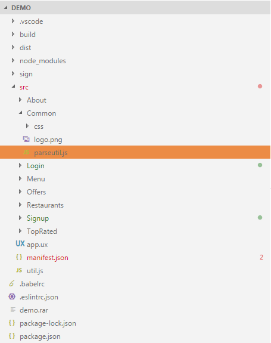
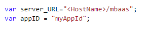

## Step 5:  Connect Mobile App to Huawei Mobile Backend

You have the Mobile Application described in this tutorial.  It is time to connect to Huawei Mobile Backend in Public Cloud.

1.	Find out the Application URL of the Mobile Backend created in Step 1 from in Service Stage Console [https://console.huaweicloud.com/servicestage/?region=cn-north-1#/apps/list](https://console.huaweicloud.com/servicestage/?region=cn-north-1#/apps/list). **The url will contain the name you picked during provisioning**, for example, http://johnsmbaas.cn-north-1.huaweicse.com.

2.	Open the file `<path to>/servicestage-mobileapp-quickapp-example/src/common/pareutil.js`  

3.  Replace myAppID with your Mobile Backend’s **appID** specified in Step 1. **The default values are demoAppId.**   

4.  Replace the host name of your Mobile Backend.  
  

5.  Save the file.  

6.  Go to Fast Application IDE, use **Build -> Run Build** to rebuild the project.

  
