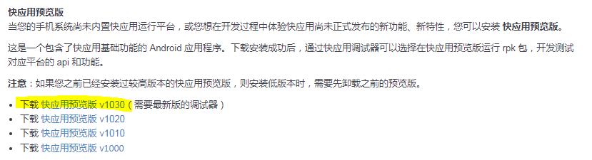
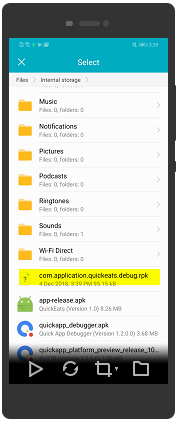

## Step 6:  Run Mobile App in Handset

To run the mobile application in the handset you need to install the Fast Application Debugger and Quick App Preview in your handset. Follow the instructions below to run the Mobile Application in Handset.

(Note: Due to security settings on Huawei computer, files cannot transfer over through USB. Use non-Huawei computer to download the following APKs, and transfer the APK files to handset).

1.  Fast Application Debugger is an Android app, download and install the debugger APK from [https://www.quickapp.cn/docCenter/post/69](https://www.quickapp.cn/docCenter/post/69)  

2.	Quick App Preview is a runtime platform to run the quick app applications in handset. Download and install the platform APK from [https://www.quickapp.cn/docCenter/post/69](https://www.quickapp.cn/docCenter/post/69)  

   After copying the apk files to your handset, Click on the apk file install the apps.
   
3.	After Installation of platform and debugger, open the debugger on your phone.  

   **Note:** If you can't click the button when you open the debugger, please upgrade your phone system to the latest version.  

   
4.	Copy the rpk file to the handset which you have generated as per the instructions in step 3, to install the rpk package using the debugger. Note: If you are building rpk file in Huawei computer, you can use public file storage service, such as Huawei Public Cloud’s [Object Storage Service](https://storage.huaweicloud.com/obs/?region=cn-north-4#/obs/buckets) to transfer the rpk file to the non-Huawei computer.  

5.	Open the debugger and Select INSTALL WITH FILE  option from the debugger menu and select the copied rpk file to install the app.  

   After the installation is successful, app will be launched as below. If not, you can launch the app from Quick App Preview.  
  

6.	Click Signup to create new account and follow the instructions to login.
