## Step 8:  (Optional) Setup Android Studio Emulator

We can also use an emulator (Android Virtual Device) from Android Studio to run the mobile application.  Firstly, you need to install Android Studio.

### Enable Virtualization in BIOS

Android Studio emulator requires hardware acceleration.  It is done by enabling virtualization from the machine’s BIOS.  
1.	Find out how to get into BIOS menu of your laptop or desktop.  It usually involvse rebooting the machine and pressing some function key(s), e.g. F2.  
2.	Once inside the BIOS menu, look for "Virtualization Support",  Enable them.

### Setup Android Studio

Android Studio is an IDE for mobile application development.  It comes with mobile phone emulators for development and testing purposes.  We will use Android Studio as the development tool in this tutorial.  

The following instructions are for installing Android Studio on Windows 10.  If you are running a different operating system or need more information.  Please visit [https://developer.android.com/studio/install](https://developer.android.com/studio/install).  

1.	Download latest Android Studio installer from the following link.  (https://developer.android.com/studio/).  For example: android-studio-ide-181.5056338-windows.exe  
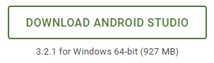

2.	Double click the downloaded exe file to start installer.  Keep the default setup to finish installation wizard.

7.	When starting Android Studio the first time, if the laptop or desktop is behind proxy, it may ask for proxy setup information.  Enter proxy information.  
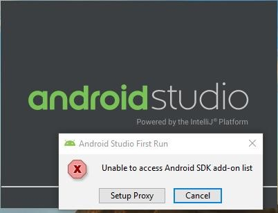  
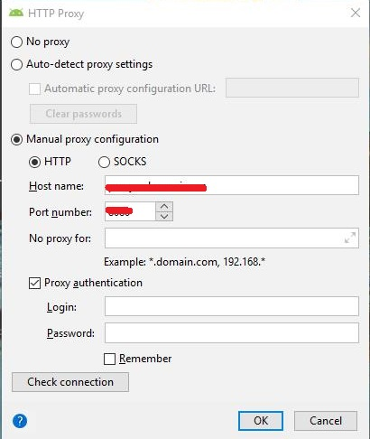  

8.	If Android SDK is not installed, it will ask you to install the Android SDK.  Follow the installer instructions to install Android SDK.  Use the provided default values.  
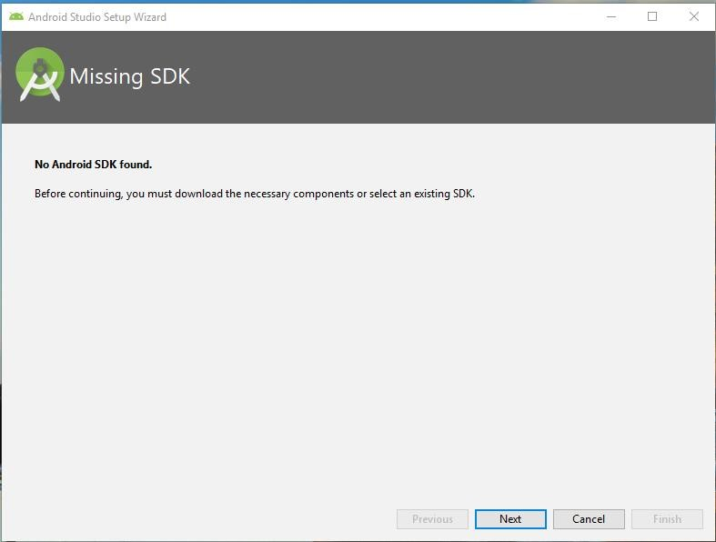  

9.	This is the screen when you start Android Studio the first time.  
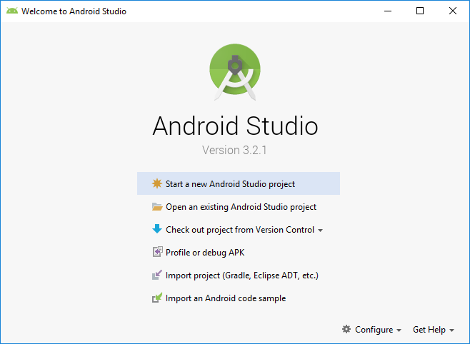  

10.	We will need to update the IDE to latest update.  Click **Configure -> Check for Updates** at the lower right corner to start update.  
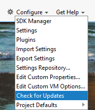  

11.	The following screen shows up once the update is completed.  
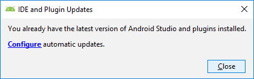  

For more information, please refer to the following references:  

- [https://developer.android.com/studio/run/emulator-acceleration](https://developer.android.com/studio/run/emulator-acceleration)  
- [https://developer.android.com/studio/run/emulator](https://developer.android.com/studio/run/emulator)  

12. Add adb.exe (Android Debug Bridge) to PATH Windows Environment Variable. adb.exe is located in C:\Users{{Your Username}}\AppData\Local\Android\Sdk\platform-tools in Windows 10.

At the Windows Start Menu, search "Advance system settings", then click "Environment Variables" at the buttom right. Find the PATH Environment Variable there. 

13. In the same Environment Variables Window, if JAVA_HOME is not set, add JAVA_HOME to Environment Variable.


### Setup Emulator
 
1.	**Important:** There is port conflict between Windows 10 background process and Android Debugger Bridge (adb). Both use port 5037. To avoid this issue, change the ADB port. At the Windows Start Menu, search “Advance system settings”, then click “Environment Variables” at the bottom-right. In the User variables section, add a new entry:  

```
   ANDROID_ADB_SERVER_PORT = 6037
```

2.  Restart Android Studio.

3.  From the menu bar, click **Tool -> AVD Manager**.

4.  Click the **Create Virtual Device…** button

5.  Select Pixel 2, then click **Next**.  
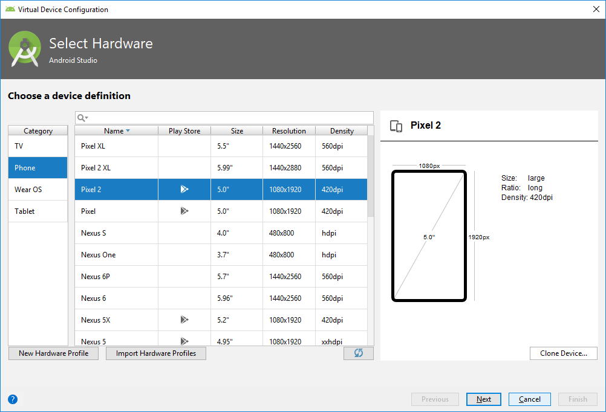

6.	Select **KitKat, API Level 19, armabi-v7a, Android 4.4.** If the Download link is enabled, click Download to install the image first; otherwise, click **Next.**  
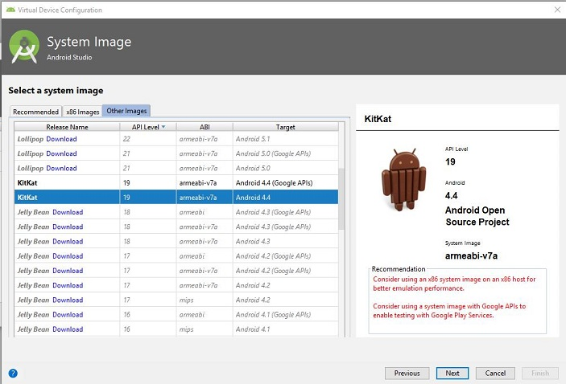

7.	Click **Finish** to add the new emulator.  
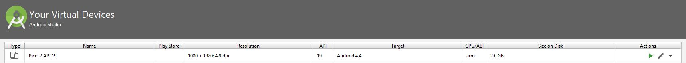

8.	Click **Finish** to add the new emulator.

9.	Click the start icon under Actions to start the emulator for the first time.  
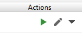

10.	 Here is how the emulator looks like.  
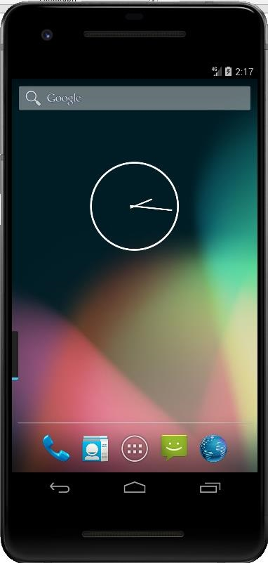

11.	Setup proxy for emulator so that the mobile applications can access the internet. Click on **…** in vertical bar to open up **Extended Controls**. Go to **Settings -> Proxy** to setup proxy:  
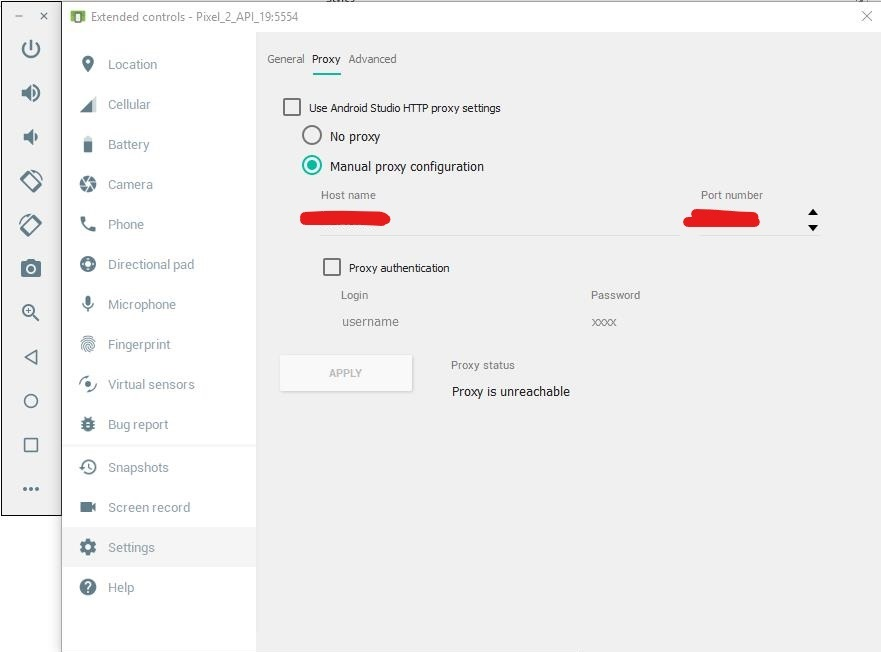
