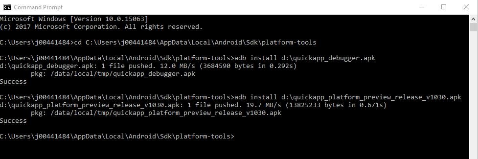
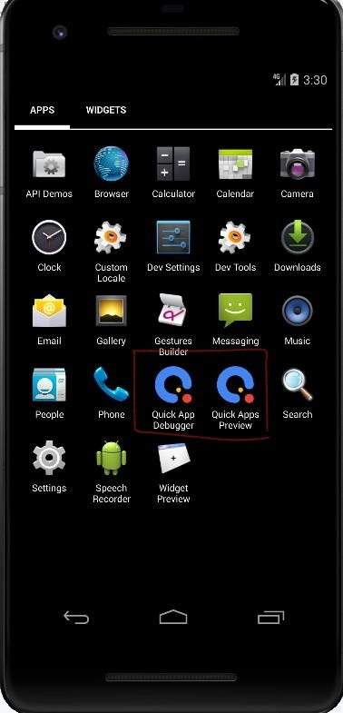
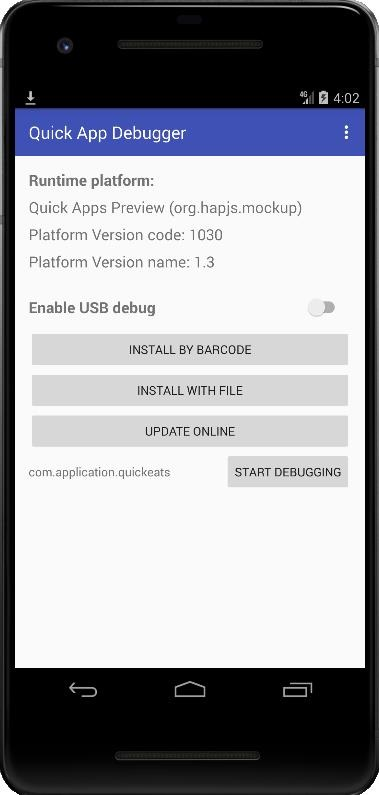

## Step 8:  (Optional) Run Mobile App in Emulator

After you successfully setup emulator in Android studio. Follow the instructions below to run QuickEats Mobile Backend Sample Application.

1.	Download the Fast Application Debugger (quickapp_debugger.apk) and QuickApp Preview (quickapp_platform_preview_release_v1030.apk) from Step 7.

2.	 Find the Android SDK folder location from Tool -> SDK Manager.

3.	In command prompt, go to {{path to}}\Android\Sdk\platform-tools, install the APKs with these commands:  

```
   .\adb.exe install {{path to}}\quickapp_debugger.apk
   .\adb.exe install {{path to}}\quickapp_platform_preview_release_v1030.apk
```


   Here is the emulator with the apks installed.  


4.	Now we will copy the QuickEats Sample Application rpk file that you built in Step 5. It should be located under the `dist` folder. To copy the file to the emulator, simply drag it to the emulator, it will be copied to `/sdcard/Download`.

5.	In emulator launch QuickApp Debugger.  


6.  Click **INSTALL WITH FILE**, the click the three dots at the top right for the Settings, check **Display advanced device**. You should now see **SDCARD** listed in the debugger. Navigate to `Download` and select `com.application.quickeats.debug.rpk`. The rpk will be installed.

7.	QuickEats Sample application is launched. If not, you can launch the application from Quick App Preview.  


8.	Click **Signup** to create new account and follow the instructions to login.
