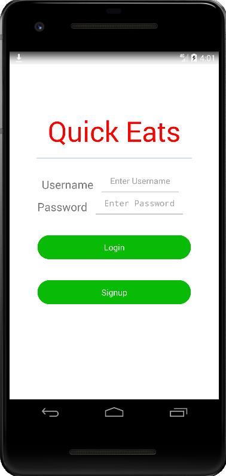

## Step 8:  (Optional) Run Mobile App in Emulator

After you successfully setup emulator in Android studio. Follow the instructions below to run QuickEats Mobile Backend Sample Application.

1.	Download the Fast Application Debugger (quickapp_debugger.apk) and QuickApp Preview (quickapp_platform_preview_release_v1030.apk) from Step 7.

2.	 Find the Android SDK folder location from Tool -> SDK Manager.

3.	In command prompt, go to `{{path from previous step}}\platform-tools`, install the APKs with these commands:  

```
   .\adb.exe install {{path to}}\quickapp_debugger.apk
   .\adb.exe install {{path to}}\quickapp_platform_preview_release_v1030.apk
```


   Here is the emulator with the apks installed.  


4.	Copy QuickEats Sample Application rpk file in Step 7 to emulator. You can use the public file storage service, such as Huawei Object Storage or drag and drop the file(It will copy file to /sdcard/Download), to transfer this file to emulator.

5.	In emulator launch QuickApp Debugger.  


6.  Click **INSTALL WITH FILE**, and select the com.application.quickeats.debug.rpk from Downloads. QuickEats Sample Application is installed successfully.

7.	QuickEats Sample application is launched. If not, you can launch the application from Quick App Preview.  


8.	Click **Signup** to create new account and follow the instructions to login.
