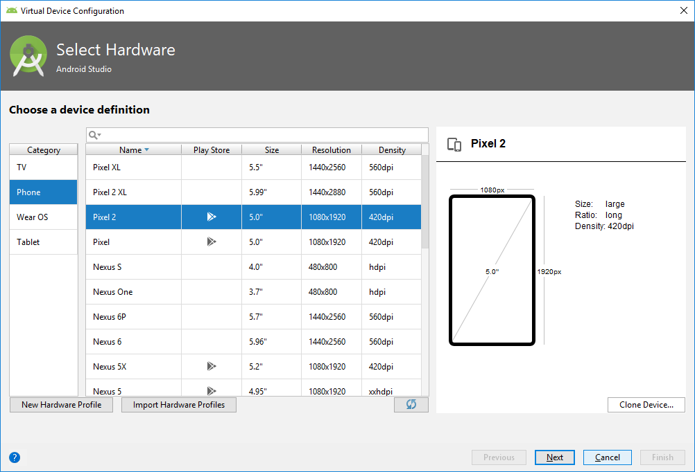
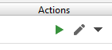

## Step 8:  (Optional) Setup Android Studio Emulator

We can also use an emulator (Android Virtual Device) from Android Studio to run the mobile application.  Follow the instructions below to add an emulator.

1.	**Important:** There is port conflict between Windows 10 background process and Android Debugger Bridge (adb). Both use port 5037. To avoid this issue, change the ADB port. At the Windows Start Menu, search “Advance system settings”, then click “Environment Variables” at the bottom-right. In the User variables section, add a new entry:  

```
   ANDROID_ADB_SERVER_PORT = 6037
```

2.  Restart Android Studio.

3.  From the menu bar, click **Tool -> AVD Manager**.

4.  Click the **Create Virtual Device…** button

5.  Select Pixel 2, then click **Next**.  


6.	Select **KitKat, API Level 19, armabi-v7a, Android 4.4.** If the Download link is enabled, click Download to install the image first; otherwise, click **Next.**  


7.	Click **Finish** to add the new emulator.  


8.	Click **Finish** to add the new emulator.

9.	Click the start icon under Actions to start the emulator for the first time.  


10.	 Here is how the emulator looks like.  


11.	Setup proxy for emulator so that the mobile applications can access the internet. Click on **…** in vertical bar to open up **Extended Controls**. Go to **Settings -> Proxy** to setup proxy:  
