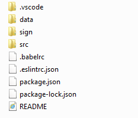
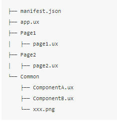
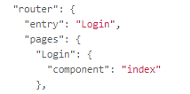
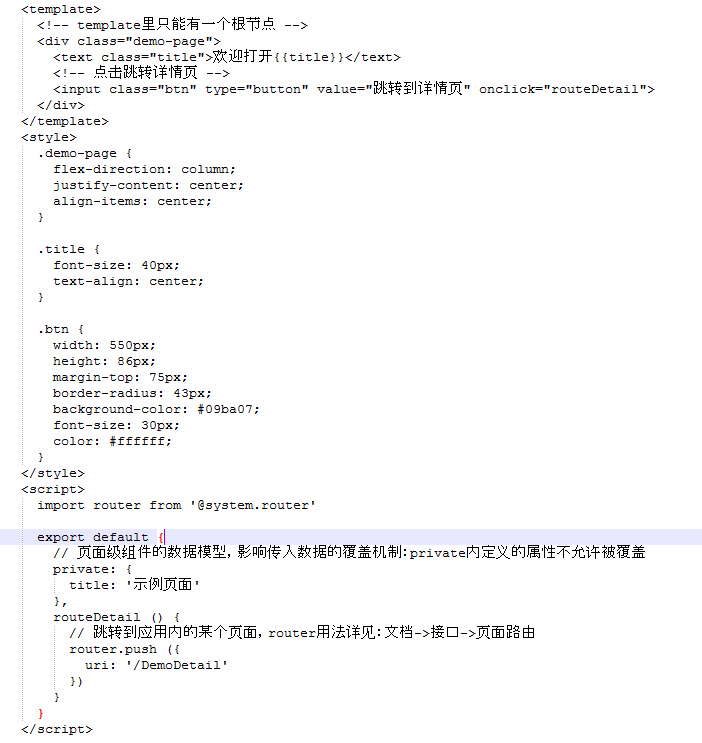
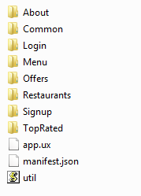
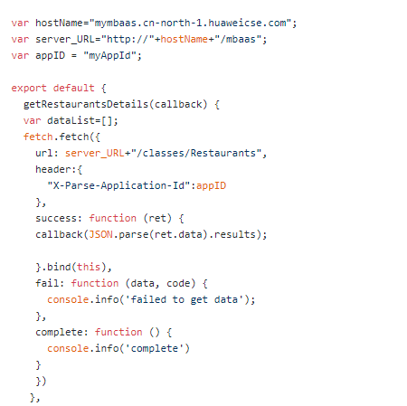

## Step 9:  (Optional) Build Mobile App using Quick App

This step explain how to build the Mobile application sample using Quick App described in this tutorial.
 
You have already completed Step 3 and loaded all the source code.  Here are how the files looks like in file system.  

Here are some of the key files / folders in the sample,
* <rootdir>/src folder contains the sample app source.
* app.ux file that includes project common resource scripts, and multiple UX files that describe pages/custom components. Typical examples are as follows.  

* Common directory is a common resource file and component file. Each page directory stores the resource files and component files of the respective pages, such as images, CSS, JS, etc.
* Manifest file, located at <rootdir>/src/manifest.json, describes essential information about your app like application descriptions, interface declarations, page routing(in “router”) and configuration related to the UI display(“display”). 

You can configure the app’s Home page (which opens as the main screen when the mobile app launches) in the manifest file.
In the sample <rootdir>/src/Login is the home page, configured in manifest. json as below.  

Pages and custom components are written in ux file. The ux file consists of three parts: template , style and script.
* Template: HTML-like tag language, combined with basic components, custom components, events, to build the structure of the page.
* Style: Component style used to describe the template and determines how component should be displayed.
* Script: Used to define page data and implementation lifecycle interfaces.

A typical example of page file is as follows,  

The sample app contains the following pages:  Login, Signup, About, Restaurants, TopRated. Every page has its own UX file in the respective folders as below. Each folder contains index.ux file with the respective page design template, script and style.  

Parse rest apis used to connect to Mobile Backend from the sample app. Configure required host and app id to connect and query data from Mobile backend. Sample restaurants query code is as shown below.  

  
  
 

